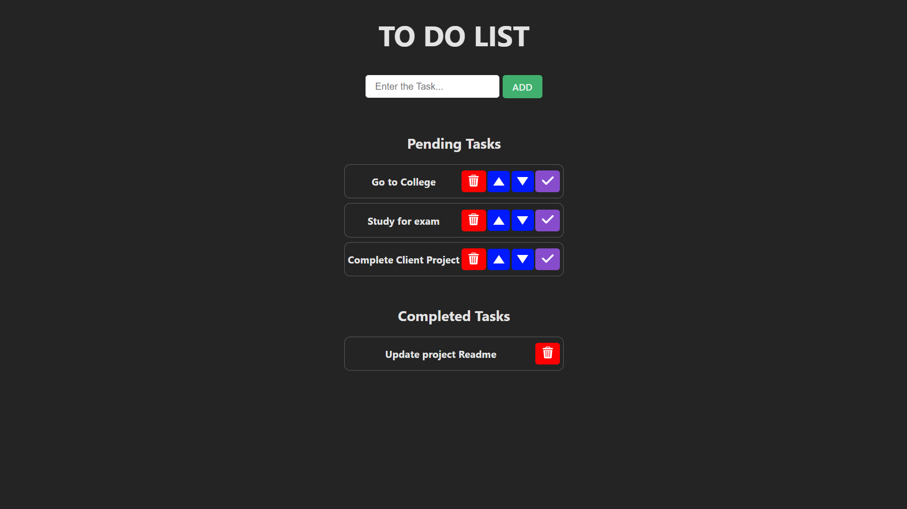

# TO DO LIST

This project is a simple yet powerful to-do list application created using React and Vite. The application allows users to add, delete, move tasks up or down, and mark tasks as complete, providing an intuitive and interactive user experience. Tasks are saved in local storage.  
https://react-to-do-list-blush.vercel.app

## Table of Contents

- [Screenshots](#screenshots)
- [Getting Started](#getting-started)
- [Prerequisites](#prerequisites)
- [Installation](#installation)
- [Running the Project](#running-the-project)

## Screenshots




## Getting Started

These instructions will help you get a copy of the project up and running on your local machine for development and testing purposes.

## Prerequisites

Before you begin, ensure you have met the following requirements:

- Node.js (version 14.x or later)
- npm (version 6.x or later) or Yarn (version 1.x or later)
- Git

You can check if you have Node.js and npm installed by running the following commands in your terminal:

```sh
node -v
npm -v
```

If you prefer using Yarn:

```sh
yarn -v
```

## Installation

1. Clone the repository:

```sh
git clone https://github.com/developerasteroid/REACT-TO-DO-LIST.git
cd REACT-TO-DO-LIST
```

2. Install dependencies:  
   Using npm:

```sh
npm install
```

Or using Yarn:

```sh
yarn
```

## Running the Project

To start the development server, run the following command:

Using npm:

```sh
npm run dev
```

Or using Yarn:

```sh
yarn dev
```

This will start the Vite development server, and you should be able to view your project in your browser at http://localhost:5173/ (default).
